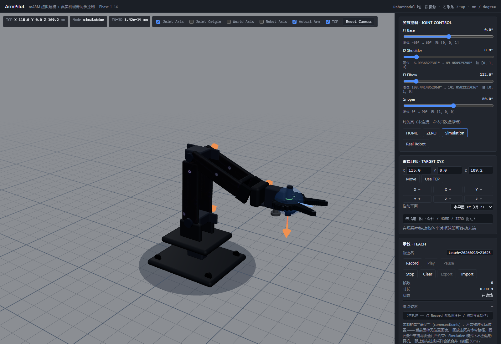

# ArmPilot · mARM 虚拟建模 + 真实机械臂同步控制系统

让**虚拟机械臂**与**真实机械臂**共享同一个 `RobotModel`，做到：

> 用户看到的虚拟 mARM，就是现实 mARM 的实时数字映射。

本仓库（`MeArm-3D`）是 ArmPilot 的**数字孪生前端 + 后端**；真实机械臂固件与服务在
同级仓库 [`MeArm-Device`](../MeArm-Device)（AVR / PlatformIO）与
[`MeArm-RemoteControl`](../MeArm-RemoteControl)（Go）中。

> **机构参数以真机实测为准**：`config/robot.yaml` 的关节角色、标定（offset/scale/reverse）、
> 限位与零位均由「相机照片 + 舵机逐度扫描」反解得到（2026-09-12），
> 推翻了最初按固件 `SERVO_LEFT/RIGHT` 推定肩/肘的假设 —— 详见
> [`docs/hardware-measurement.md`](docs/hardware-measurement.md) 与 `docs/decisions.md` D15–D17。



<sub>上图为 HOME 位（四舵机全 90° = 固件 RESET 位）的虚拟臂渲染，与实拍照片目视一致；J1 0.0° / J2 0.8° / J3 112.6° / Gripper 50.0°，TCP `112.0, 0, 93.8 mm`。</sub>

---

## 1. 架构

```
                      ArmPilot
                         │
                   RobotModel          ← config/robot.yaml（唯一数据源）
                         │
             ┌───────────┴───────────┐
             ↓                       ↓
       Virtual Robot             Real Robot
        (Three.js)              (mARM / AVR)
             │                       │
             └───────────┬───────────┘
                         │
                    Joint State
                         │
                       FK/IK
```

**正向（操作虚拟臂 → 控制真实臂）**

```
滑杆/鼠标 → Joint State → 安全检查 → Actuator Mapping(标定) → Transport → Go → Serial → AVR → 舵机
```

**反向（真实臂状态 → 同步虚拟臂）**

```
舵机 → AVR → Serial → Go → WebSocket → RobotState → Virtual Robot
```

**传输层分层（Phase 7–8 已落地，Phase 9 才接真串口）**

```
store.commandJoints
   │ 尾沿合并 33ms（transportBridge）
   ▼
RobotTransport ──┬─ MockTransport        （Phase 7：纯虚拟闭环，不碰网络）
                 └─ WebSocketTransport    （Phase 8：JSON ↔ 真实 Go 后端）
                          │
                          ▼
     Go: wsserver → controller → device（sim | serial）
                          │  JR / OK JR / STATE（文本行）
                          ▼
              内置 sim「假固件」（Phase 8）  |  AVR（Phase 9）
```

| 环节 | Phase 7 | Phase 8 | Phase 9 |
|------|---------|---------|---------|
| 前端 ↔ 传输 | `MockTransport` | **`WebSocketTransport`（JSON）** | 同 Phase 8 |
| 传输 ↔ 机械臂 | —（同进程） | **内置 sim 假固件，走真实字节流** | 串口 115200 + ACK 门控 |
| 标定 / 限位来源 | `robot.yaml` | **同一份文件**（后端也读它，`hello` 在线互检） | 同 |

## 2. 技术栈

| 层 | 选型 |
|----|------|
| 前端 | React 19 · TypeScript · Vite · Three.js · React Three Fiber · @react-three/drei · Zustand |
| 后端 | **Go 1.21+（自包含 module `armpilot/backend`）· 标准库 RFC6455 WebSocket · HTTP `/healthz`**（Phase 8 ✅） |
| 真实臂 | AVR (ATmega328P) · 串口 115200 8N1（Phase 9） |
| 测试 | Vitest（单元 / 验收）· `go test`（后端）· 零依赖 CDP e2e（无头 Edge/Chrome） |

## 3. 目录结构

```
MeArm-3D/
├── config/robot.yaml             # ★ 唯一模型定义（links / joints / actuators / home / tcp）
├── docs/
│   ├── coordinate-system.md      # ★ 坐标系、单位、运动学链规则、标定表（权威文档）
│   ├── model-structure.md        # ★ 显式几何（plate/servo/details）与运动学的边界
│   ├── hardware-measurement.md   # ★★ 真机实测记录：角色映射 / 绝对角解耦 / 标定 / 不确定度
│   ├── decisions.md              # 设计决策 ADR（D1–D33；D15–D17 实测修正，D27–D33 Phase 8）
│   └── images/                   # 界面截图（armpilot-console.png 由 e2e 自动重出）
├── protocol/serial-v1.md         # ★ 串口 / WS 协议基线（§4 固件侧待 Phase 9；§5 上位机侧 Phase 8 已实现）
├── tools/                        # ★ 真机实测工具链（Python 3 + numpy，独立于前端）
│   ├── mearm_hw.py               # 串口控制 + 相机抓拍（单进程，避开 DTR 复位陷阱）
│   ├── analyze_sweep.py          # 逐度扫描图 → 白底暗件分割 → 面积/重心/最高点/红绿差分
│   ├── segment_arm.py            # 公共静止区自动分段：底座 / 大臂 / 小臂 + PCA 定方向
│   ├── fit_pivot.py              # 圆拟合枢轴（Kasa）+ 爪尖极角转角 + 不动区质心互证
│   └── fit_pose.py               # ★★ FK 骨架 ↔ 实拍照片拟合（对称 Chamfer + Hooke-Jeeves）
├── frontend/
│   ├── src/robot/
│   │   ├── model/             # RobotModel · Link · Joint · Actuator · Pose · RobotState · RobotCommand
│   │   ├── kinematics/        # coordinate（转换层）· transform（矩阵）· fk · ik（逆解）
│   │   ├── interaction/       # dragPlane：拖动平面 + 射线求交（纯数学、零依赖）
│   │   ├── calibration/       # 关节角 ↔ 舵机角 标定
│   │   └── transport/         # RobotTransport 抽象 · MockTransport（有限角速度/延迟/丢帧/限位拒绝）
│   │                          # WebSocketTransport（Phase 8）· wsProtocol（纯函数编解码 + 链路精度）
│   │                          # socket（SocketLike 可注入）· timer（可注入时钟）
│   ├── src/components/        # RobotScene（buildRobotObject3D 参数化拼装 · DragHandle 拖动把手 · TestProbe dev探针）
│   │                          # RobotControl（JointControl 滑杆 · TargetControl 末端目标 · ConnectionControl 连接面板）
│   ├── src/store/             # Zustand 唯一状态仓库 · transportBridge（尾沿节流 / 回推落地 / 回环打破 / 重连补发）
│   └── tests/                 # unit / acceptance / e2e
├── backend/                   # ★ Phase 8：关节级 WebSocket 服务（自包含 Go module）
│   ├── main.go                # 组装：cfg → robot.Model → device → controller → wsserver
│   ├── config.yaml            # **只放运行参数**（端口 / 设备模式 / 模拟器参数），禁写限位与标定
│   ├── internal/robot/        # 读 robot.yaml；关节↔舵机换算；限位校验（唯一"真值"入口）
│   ├── internal/protocol/     # JSON / JR / OK JR / STATE / ERR 编解码（不认识机械结构）
│   ├── internal/controller/   # ★ 唯一"懂机械臂"处：ACK 门控 · latest-wins · 标定核对 · 状态发布
│   ├── internal/device/       # sim.go（假固件，Phase 8）· serial.go（Phase 9 桩，显式返回未实现）
│   ├── internal/wsserver/     # 标准库 RFC6455 服务端 · 路由 · 广播 · 两层心跳
│   └── README.md              # 架构图 · 与 MeArm-RemoteControl 的分工 · 测试矩阵
└── tests/                     # （Phase 9+ 固件 / 硬件在环）
```

## 4. 快速开始

### 一键启动（推荐）

根目录下的 `start.bat` 会拉起后端 + 前端，并让页面**自动连上后端**（不再是默认的
浏览器内 Mock 仿真）：

```bat
start.bat              :: SIM 模式（默认，不碰硬件）
start.bat --real       :: REAL 模式（config.serial.yaml，会真的动舵机）
start.bat --help       :: 用法
```

它做的事：检查 `backend/bin/armpilot-backend.exe` / `config/robot.yaml` / node 是否存在、
探测并（经你确认后）清理占用 8090 / 5273 的残留进程、按模式起两个窗口、
打印本机与局域网访问地址。

`start.bat` 会往前端注入两个环境变量，这正是"一键启动后页面自动进入 ws 模式"的实现：

| 变量 | SIM 模式 | REAL 模式 | 作用 |
|------|---------|----------|------|
| `VITE_AUTO_CONNECT` | `ws` | `ws` | 页面挂载后自动连 WebSocket 后端（而非浏览器内 Mock） |
| `VITE_AUTO_REAL` | 不设 | `1` | 连接成功后自动切到 Real Robot（带校验，见下） |

> ⚠️ **REAL 模式下若后端链路末端不是 serial**（例如没插机械臂、串口号不对），
> 自动切换会**被拒绝**（按钮保持 Simulation），日志给出拒绝原因与实际末端。
> 这是刻意的：静默降级比明确报错更危险。
>
> 同理，**SIM 模式下手动点 Real Robot 也会被拒绝** —— 后端末端是 `sim` 就不该显示
> "正在驱动真实机械臂"。判据见 ADR **D43**。
>
> 不想要自动连接时，直接 `cd frontend && npm run dev` —— 未注入环境变量时行为完全不变
> （仍停在 Mock，等你手动点 Connect）。

### 手动启动

```bash
# 前端
cd frontend
npm install
npm run dev            # 本机 http://localhost:5273；局域网 http://<本机IP>:5273
npm run typecheck      # tsc -b，零错误
npm test               # vitest（单元 + 验收），233 项
npm run test:e2e       # 真浏览器冒烟（需先 npm run dev；见下方参数说明）
npm run build          # 生产构建

# 后端（Phase 8）
cd ../backend
go build -o bin/armpilot-backend.exe .
./bin/armpilot-backend.exe -c config.yaml     # 监听 0.0.0.0:8090，端点 /ws/joint
curl http://127.0.0.1:8090/healthz            # {"ok":true,"device":"sim","linked":true,"state":{…}}
go test ./...                                 # 56 项
```

> **局域网访问**：Vite 已设 `server.host: true`、后端已监听 `0.0.0.0:8090`，
> 同一 WiFi 下的手机/平板打开 `http://<本机IP>:5273` 即可。
>
> 前端**不写死** `ws://localhost:8090` —— 那样局域网访问时浏览器会把 `localhost`
> 解析成**访问者自己那台设备**，表现为"页面能开、但一直重连"。实际按
> `window.location.hostname` 推导（见 `ConnectionControl.tsx` 的 `getDefaultWsUrl`）：
> 本机访问 → `ws://localhost:8090`，局域网访问 → `ws://<本机IP>:8090`。
> 需要指向别的后端时用 `VITE_WS_URL=ws://host:port/ws/joint` 显式覆盖。
>
> 首次从局域网访问若连不上，检查 Windows 防火墙是否放行
> `node.exe` / `armpilot-backend`（本机已有这两条入站规则，生效于**公用**配置档）。

> e2e 脚本（零依赖 CDP，直接驱动无头 Edge/Chrome）参数为
> `node tests/e2e/ui-smoke.mjs [url] [debugPort] [screenshotPngPath]`；
> 传第 3 个参数时会**在 HOME 位自动重建** `docs/images/armpilot-console.png`：

```bash
node tests/e2e/ui-smoke.mjs http://localhost:5273 9333 ../docs/images/armpilot-console.png
```

> **e2e 会自动拉起后端**（`backend/bin/armpilot-backend.exe`）并在结束后清理进程。
> 若 8090 上已有实例，则复用该实例并**跳过**"断线重连"子项（脚本杀不掉别人的进程）。

### 驱动真实机械臂（Real Robot）

**一条命令**（`start.bat` 会做完下面手动三步的全部事情）：

```bat
start.bat --real
```

确认后端窗口出现 `[serial] 已连接 COM16 @ 115200 8N1`，
页面提示条显示「★ 正在驱动真实机械臂（链路末端 serial）」即可。
串口号在 `backend/config.serial.yaml` 的 `device.serial.port` 里改。

<details>
<summary>手动三步（不用脚本时）</summary>

```bash
# 1. 用真机配置启动后端（config.yaml 是 sim，不会碰硬件）
cd backend && ./bin/armpilot-backend.exe -c config.serial.yaml

# 2. 前端连上这个后端
cd frontend && npm run dev
#    在 Connection 面板切到 WebSocket → 输入 ws://localhost:8090/ws/joint → Connect

# 3. 在「关节控制」卡片点 Real Robot
```

</details>

**「命令去向」提示条的含义**（`data-testid="mode-routing"`）：

| 提示 | 含义 |
|------|------|
| 纯仿真（未连接…） | 没连传输，命令只改虚拟臂 |
| 已拦截：Simulation 模式下不下发给真机 | **连着真机但模式是 Simulation** ⇒ 安全门生效，真机不动 |
| ★ 正在驱动真实机械臂（链路末端 serial） | 真机模式 + 真机链路，命令会下发给硬件 |
| Real 模式下…非真机 / 连接的是 Mock / 末端未知 | 模式选对了但链路不对，检查后端是否用 `config.serial.yaml` 启动 |

> ⚠️ **真机没有位置反馈**（无编码器）：界面上的 `Actual` 是**固件内部目标值反算**，
> 不代表已物理到位。唯一的外部真值是相机 —— 见下方 Phase 9 验收与 `tools/verify_pose.py`。

## 5. 阶段进度

| Phase | 内容 | 状态 | 验收证据 |
|-------|------|------|----------|
| 1 | RobotModel（唯一数据源） | ✅ | 单测 10 项；改 yaml 单字段即生效 |
| 2 | Three.js 3D 机械臂 | ✅ | 无头浏览器截图 + e2e 渲染断言；**按实物 meArm 参数化重做外观**（蓝板 + 4 舵机 + 轴销，见 `docs/model-structure.md`）；**舵机布置按真机实测修正为 S9 底座 / S7 肩 / S8 肘 / S6 夹取** |
| 3 | FK | ✅ | **FK↔Three.js 最大误差 8.673e-14 mm**（要求 < 0.1） |
| 4 | Joint Control | ✅ | 单测 7 项 + e2e 滑杆交互 |
| **4.5** | **真机参数实测（相机反解机构）** | ✅ | 白底分割 + 舵机逐度扫描 + FK 骨架拟合：修正 S7/S8 角色映射、确证**小臂绝对角（平行四连杆，耦合 gain=-1）**、反解标定/限位/零位并写入 `config/robot.yaml`（见 `docs/hardware-measurement.md`、`docs/decisions.md` D15–D17） |
| 5 | IK（XYZ → J1/J2/J3） | ✅ | **FK(IK(XYZ)) 2000 组随机位姿最大残差 1.401e-13 mm**；错误码 `OUT_OF_WORKSPACE` / `JOINT_LIMIT`；多解 `elbow-up/elbow-down/nearest`（默认就近）；几何量全部从模型求导，改 yaml 即生效（见 `docs/coordinate-system.md` §3.1、D18/D19） |
| 6 | XYZ / 鼠标拖动末端 | ✅ | XYZ 直输 + **鼠标真实拖拽**（e2e 用 CDP 派发真实鼠标事件命中场景把手，Δ 17.47mm）；三种拖动平面 xy/xz/camera 在 pointerdown **冻结**；**越界不钳位**（关节逐位不变）；400 点轨迹穿越工作空间边界验收（见 `docs/coordinate-system.md` §3.2、D20–D22） |
| 7 | MockTransport 闭环 | ✅ | 完整双向闭环（命令 → 尾沿节流 → Mock → 回推 → Actual）；Mock **如实模拟舵机有限角速度 / 传输延迟 / 丢帧 / 限位拒绝**（非等值回显）；回推**只写 Actual**（回环打破，400 点轨迹引用从未改变）；Connection 面板可实时调参（见 `docs/coordinate-system.md` §3.3、D23–D26） |
| 8 | **Go WebSocket** | ✅ | **后端独立 module `backend/`（8090）+ 内置「假固件」sim**：命令走 `JSON → JR 文本 → 舵机角 → 反算关节角 → STATE` 真实往返，非等值回显；`OK JR` **只做标定核对不发布状态**；ACK 门控 + latest-wins；`hello` 带模型真值在线互检；两层心跳；断线指数退避重连**并补发当前命令**。`go test` 56 项 · 前端新增 66 项单测（`wsProtocol` 25 / `WebSocketTransport` 30 / 接线验收 11）· e2e 新增 21 项真实 WS 端到端（见 `docs/coordinate-system.md` §3.4、`protocol/serial-v1.md` §5、D27–D33） |
| **9** | **Serial（真机）** | ✅ | `internal/device/serial.go` 落地真串口（Windows 非重叠 I/O，**不用 `bufio`**）；Uno DTR 复位静默窗口 `connect_settle_ms=2600` + 暖机包。**真机端到端闭环实测 PASS 18 / FAIL 1**：`hello=serial` · `homePose` 与 `robot.yaml` 逐位一致 · 7 步链路回推 `max\|Δ\| ≤ 0.004°` · 相机反解重复性肩 `0.26°`/肘 `0.01°`。见 `tools/verify_serial_e2e.mjs`、`docs/decisions.md` D34–D36 |
| 10 | Real Robot | ✅ | 机构角色 / 标定 / 限位 / 零位**已实测就绪**（Phase 4.5 + `config/robot.yaml`）；Serial 已落地 ⇒ 浏览器拖动能**真实驱动物理机械臂**。**2026-09-12 修复 mode↔transport 联动缺口**：`Real Robot` 按钮原先只改 UI 样式、命令照样走当前 transport（"点了真机不动 / 切回仿真仍在动真机"），现补准入校验 + 安全门 + 去向提示（ADR **D41**）。⚠️ 相机验收已测出**肩标定增益偏差 −13.1%**（肘 +1.4% 已证实），需按锁死曝光重布台面后重测 |
| **10.5** | **一键启动 `start.bat`** | ✅ | 根目录 `start.bat`：前置检查（backend exe / robot.yaml / node）、端口探测+确认清理（8090/5273）、按模式起前后端、打印本机+局域网地址。**关键**：注入 `VITE_AUTO_CONNECT=ws`（+ `--real` 时 `VITE_AUTO_REAL=1`）让页面**自动连后端并切 Real Robot** —— 原先页面默认停在 MockTransport 且不会自动连接，"脚本起好了但只动仿真臂"（ADR **D42**）。`npm run dev` 不注入，手动调试行为不变 |
| **10.6** | **Real Robot 准入改为"拒绝"** | ✅ | 用户报障「前端显示 Real 模式但后端末端是 sim」。根因：`setMode('real')` 把 `set({ mode })` 写在准入校验**之前**，校验只 pushLog、状态照改（D41 只修了一半，且旧测试还把该行为固化成契约）。现改为**校验全通过才切换**，否则保持 Simulation 并说明原因；`device` 未知（hello 未到）也拒绝，`useAutoConnect` 相应改为等 device 到达再切（ADR **D43**） |
| 11 | Real Feedback | ⏳ | 误差链路与「Actual 由实际舵机角反算」的机制已在 Phase 8 的 sim 上验证过 |
| 12 | 虚拟 / 真实同步 | ⏳ | — |

### 本阶段明确**不实现**

AI · 机器学习 · 强化学习（PPO/SAC）· 视觉识别 · 摄像头 · 目标检测 · 数据集 · 模型训练 ·
ONNX · 语音控制 · 动作学习 · MuJoCo 训练 · Sim2Real。
架构已按 spec §三十八 预留 `RobotCommand` / `RobotState` / `RobotModel` / `RobotTransport`
四个扩展边界，未来能力（视觉 / AI / 语音 / MuJoCo）只需归一到 `RobotCommand` 即可接入。

## 6. 当前验收数据（Phase 1–9）

```
类型检查      tsc -b                    0 error
单元测试      vitest run                233 / 233 PASS（17 文件；含 13 项几何回归 · 19 项 IK · 19 项拖动平面 ·
                                       13 项目标语义 · 30 项 wsProtocol · 33 项 WebSocketTransport ·
                                       17 项自动连接意图与切换时序 · 12 项 mode↔transport 联动）
后端单测      go test ./...             56 / 56 PASS（5 包：robot · protocol · device · controller · wsserver）
                                        + go vet 干净 · gofmt -l 无输出
浏览器 e2e    node tests/e2e/ui-smoke   52 / 52 PASS（含 25 项 Phase 8 真实 WebSocket 端到端
                                        + 4 项 Phase 10.6 Real Robot 准入拒绝；连跑三轮稳定）
生产构建      vite build                1,294.98 kB (gzip 364.40 kB)
FK↔Three.js  200 组随机关节状态         末端位置最大误差 8.673e-14 mm
                                       关节矩阵最大元素误差 8.527e-14
FK(IK(XYZ))  2000 组随机可达位姿         末端位置最大残差 1.401e-13 mm（失败 0 组）
IK 拖动连续性 300 点就近跟随             最大误差 1.017e-13 mm，支解切换 0 次
拖动轨迹      400 点穿越工作空间边界      边界定位到一格（1.5mm）内；越界段关节**零变化**
真实鼠标拖拽  无头 Edge + CDP 真实事件    Δ 17.47 mm；被锁轴 Z **逐位相同**（93.83984236589028）
测试探针      生产构建产物                不含 __armPilot（dev-only 门控生效）
运行态       真实浏览器（swiftshader）   FK↔3D = 3.18e-14 mm @ 初始位姿
几何↔运动学  抹掉全部 geometry/details   endEffectorPosition 逐位不变
真机一致性    HOME 位（四舵机全 90°）    虚拟臂渲染姿态与实拍照片目视一致
──────────── Phase 7 · 传输闭环（Mock） ────────────
Mock 物理约束 240°/s · 15ms 延迟 · tick 20ms   每 tick 恰好 4.8°；阶跃 40° 约 182ms 收敛
延迟语义      命令送达前                  不回推任何状态；送达瞬间走出第一步
丢帧语义      dropRate = 1                机械臂照常收敛到目标，但 received = 0（丢帧只影响上报）
限位拒绝      越界命令                    ERR JOINT 且**位置保持不动**；rejected +1
节流          400 次命令变化              实际下发 10–80 条（尾沿合并 33ms + 结束补发）
回环打破      400 点拖动轨迹              回推期间 `commandJoints` **引用从未改变**（toBe 断言）
断开语义      断开连接                    Actual 拉回 Command，不留假误差
e2e 实测      滑杆跳 40°                  即时 cmd 39.9° / act 0.8°（差 39.1°）→ 收敛 39.9° / 39.9°
收敛即停      到位后 tick 归零            无残留定时器空转（FakeTimer.pending() === 0）
──────────── Phase 8 · 真实 Go 后端 + 内置假固件 ────────────
后端真值      读 ../config/robot.yaml     /healthz.state = HOME 位（shoulder 0.8498937633 / elbow 112.6185771989）
标定往返      JR 1 位小数 → 舵机角 → 反算   HOME 位逐位自洽；改标定表即表现为 Actual ≠ Command
非等值回显    后端集成测试                命令 → 6 步中间态 4.18→7.52→10.85→14.18→17.51→20.80（等值回显必失败）
OK JR 语义    回执是**目标**角             只用于核对标定（容差 0.1°）；状态只认 STATE（舵机实际角反算）
ACK 门控      同一时刻 1 条在途            在途期间新命令只覆盖"待发槽"，不排队（latest-wins）
链路精度      0.1°（JR 1 位小数）          e2e `stat-lag` = 0.00°（修复前恒为 0.02° 假误差，见 D31）
两层心跳      应用层 ping/pong + RFC6455   e2e 实测 RTT 19–22 ms；服务端 40s 静默判死
模型互检      hello 带限位/标定/通道       前后端读同一份 yaml ⇒ 无告警；差异会被逐项报出
断线重连      指数退避 500→1000→2000…      e2e 杀掉后端再重启（新 sim 从 HOME 起步）⇒ Actual 回到 29.9°
e2e 实测      滑杆跳 30°                  即时 cmd 29.9° / act 0.8°（差 29.1°）→ 收敛 29.9° / 29.9°
──────────── Phase 9 · 真串口 + 相机地面真值 ────────────
链路末端      后端 hello                  device=serial（真机，不再是内置假固件）
标定单一真值  homePose 逐位比对           base 0 / shoulder 0.8498937633 / elbow 112.6185771989 / gripper 50
开机就绪门    Uno DTR 复位静默窗口         connect_settle_ms=2600 + 暖机包 ⇒ 不再出现 DEVICE_UNAVAILABLE
链路回推      7 步 JR 命令                max|Δ(意图角, 回执角)| ≤ 0.004°（纯链路自洽，**不含物理**）
物理到位      **相机**反解（唯一真值）      PASS 18 / FAIL 1（19 项）
相机重复性    同位姿两帧（00_reset vs 06_reset2）  肩 0.26° / 肘 0.01° —— 噪声底
增益复核      反解 Δ关节/Δ舵机 vs yaml    肘 −0.4235 vs −0.4177 ⇒ **+1.4%，肘标定被独立证实**
                                        肩 +0.6033 vs +0.6944 ⇒ **−13.1%，肩标定需重测**
曝光漂移      ⚠️ 同台面相隔 2 分钟两批   锚点绝对角偏置 +2.69° → +7.75°（漂 5°），Otsu 两批均 164
                                        ⇒ **自动曝光是绝对角主导误差源，高精度验收前必须锁死曝光**
```

> **Phase 9 最重要的一条结论**：真机固件**没有位置反馈**（`arm_get_angle()` 回的是固件记着的
> **目标值**）。所以 `OK SET` / `STATUS` / 后端 `joint_state` **全都在说「我打算去哪」**，
> 没有一条能证明「它实际上在哪」—— 哪怕机械臂卡死在桌上，回执依然一字不差。
> **串口回执原理上无法验证物理到位，唯一的外部地面真值是相机。**
> 见 `tools/verify_serial_e2e.mjs`（闭环主控）与 `tools/verify_pose.py`（反解内核），
> 决策记录见 `docs/decisions.md` D34–D38。

**2026-09-12 复测补记（19:25 批，D37/D38）**

| 项 | 值 |
|----|-----|
| 脚本可诊断性 | `verify_serial_e2e.mjs` 加**逐步日志**（`run.log`，带相对时间+耗时）+ 顶层错误打印**完整堆栈**，并区分 **exit 2 = 脚本崩溃 / exit 1 = 验收 FAIL**（此前两者都被当成"崩了"） |
| **ROI 不改** | 用户要求"用新 ROI 更新数据"；单批实验确曾把锚点偏置从 −2.20° 改善到 **−0.45°**，但**跨批验证推翻**：另一批各帧误差均值 6.29 → **12.17**（翻倍恶化）⇒ 单批"最优"是过拟合，**维持 `(330,150,1040,530)`** |
| **主误差源定位** | 反解标定增益偏差 **肩 +34% / 肘 −50%**，且**随行程放大**（+5° 命令误差 ~0.5°，+15° 涨到 +3.6~4.5°）⇒ 与 `hardware-measurement.md` §2 早已挂起的**平行四连杆耦合增益残差（实测 ≈ −0.81 而非 −1）** 完全吻合 |
| 根因（目视复核） | 骨架拟合贴的是臂的**外轮廓边**而非连杆轴线；meArm 小臂是**两根平行杆**，三连杆骨架模型**结构上表达不了它** ⇒ **须改模型，不是调 ROI** |
| 新增工具 | `tools/measure_roi.py`：量臂紧包围盒 + 给 ROI 建议值 + 可视化（**辅助目视工具**；数值会被线缆/桌沿污染成 `x0=0,x1=1279`，必须目视复核） |

### 真机端到端闭环（Phase 9）

```
verify_serial_e2e.mjs ──WebSocket(JSON，关节级)──▶ backend(serial) ──JR──▶ 固件 ──▶ 舵机 ──┐
        ▲                                                                                  │ 物理运动
        │  joint_state（开环**目标值**，只作链路自洽性参考，不作到位证据）                    │
        └── ffmpeg 抓帧 ◀────────────────────── 相机 ◀──────────────────────────────────────┘
                     │
                     ▼  tools/verify_pose.py（FK 侧视骨架 ↔ 实拍掩膜，反解肩/肘绝对角）
              与本步意图关节角比对 → PASS / FAIL
```

| 项 | 值 |
|----|-----|
| 动作计划 | `00_reset` / `01_sh_p5` / `02_sh_p15` / `03_el_p5` / `04_el_p15` / `05_combo` / `06_reset2`（单关节 ±5°/±15° 安全流程，结束回 RESET） |
| **期望值取量化角** | 固件只吃**整数舵机度**，物理落点是 `servoToJoint(round(jointToServo(θ)))`，与意图角天然差 `0.347°`(肩)/`0.209°`(肘) ⇒ 取意图角当期望 = 白送假误差（由 `verify_pose.py --quantize` 给出） |
| **判据一：绝对误差** | `--tol 5.0°`，会被**轮廓厚度系统偏置**污染 ⇒ **只作粗筛** |
| **判据二：帧间差** | `--dtol 1.5°`，对 RESET 锚点帧取差、**抵消公共偏置** ⇒ **锐利判据**（结论只认它） |
| 分割阈值 | `--thresh auto`（全批 Otsu 中位数）。实测新批 164/165/165、老批 111/114/114 |
| 底座掩膜 | `--base-region self`（**从本批自身派生**）。跨批复用掩膜会让锚点偏置 −5.79°→+2.69°、PASS 1/7→5/7 |
| base 约束 | 相机只能测矢状面 ⇒ **base 必须留 0°**，离面即判 SKIP（而不是硬算一个假角度） |

> **为什么绝对误差只能当粗筛**：对称 Chamfer 拟合的偏置**随轮廓厚度单调增长**
> （`--selftest` 自检 B：20px → 肩 −0.24°/肘 +0.10°；60px → +1.19°/+1.78°；100px → +3.40°/+5.49°）。
> 这与 `robot.yaml` 自述的「绝对角 ±5° 量级不确定度」吻合 —— 单看绝对误差，
> **分不清「标定错了 3°」和「轮廓画厚了 20px」**。
>
> ⚠️ **当前绝对角的不确定度还不足以判定 1° 级标定。** 要压到 1~2° 必须按
> `docs/hardware-measurement.md` 的 **Phase 4.5 标准重布台面**：
> 白分割板铺满视场 + 画面内放一把尺 + 尽量正交侧视取景 + **锁死相机曝光**（关闭自动曝光/白平衡）。
> **锁死曝光是硬要求，不是优化项** —— 实测自动曝光漂移就能让绝对角偏 5°。

#### 复测记录 · 2026-09-12 20:42（线缆固定后 · ADR D40）

按 D39 的前置要求固定线缆后重跑，**D39 的修复得到决定性验证**：

| 指标 | 20:31 批（相机漂 6px） | **20:42 批（线缆已固定）** |
|------|----------------------|--------------------------|
| 拟合尺度 `s` | 3.670 px/mm（−7.2%） | **3.969 px/mm** ✅ |
| 肩枢轴 | 漂移，锚点偏 −4.12° | **(548.7, 520.2)**，锚点偏 −1.62° ✅ |
| 重复性（肩） | 2.81° ❌ | **0.83°** ✅ |
| 反解 PASS | 1/7 | **3/7** |
| 总判定 | PASS 18 / FAIL 2 | **PASS 18 / FAIL 2** |

**新发现的第四类污染源：手入镜。** `06_reset2` 帧的三个异常信号同时出现 ——
JPEG 体积 +2.7%、反解残差 **69.76px**（其余帧 28~42）、肘帧间差 **−3.81°**；
目视确认画面右上**有一只正在调线缆的手**。手的像素被分割器并入臂掩膜，
把联合拟合拉到错误解。

> **这一条 FAIL 恰恰证明判据有效**：失败的是「重复性」—— 正是 D39 §2 定的健康检查。
> **判据抓到了污染源，而不是被污染误导。**

**开跑前的量化闸门**（新增 `.workbuddy/analysis/_cam_stability.py`，10 帧静止场景）：

```
逐帧 vs 首帧：dx=0 dy=0（全 10 帧）    相邻帧：dx=0 dy=0（全 9 对）
整图中位 155.0（波动 0.00）           整图均值波动 0.10
⇒ 位移恒为 0，可以开跑
```

⇒ **采集前置硬要求共四条**：锁曝光 · 锁相机 · 锁线缆 · **人员离场**（手/反光物不得入 ROI）。

端到端数值抽查（与解析解逐位吻合，`frontend/tests/e2e/ui-smoke.mjs` 自动断言）：

| 关节状态（θ 为**绝对角**，degree） | 末端 TCP（页面读数） | 解析解 |
|----------|----------|--------|
| **HOME** (0, 0.849894, 112.618577, 50) | (112.0, 0.0, 93.8) | (111.957, 0, 93.840) |
| J2 滑杆 → 39.9°（量程 −6.09..49.45 量化） | Z 75.2 | Z 75.222 |
| J2 39.9° + J3 滑杆 60° → **钳位到限位 min 108.441485** | (165.2, 0, 83.4) | (165.154, 0, 83.413) |
| 夹爪滑杆 90° | TCP 与上行差 < 0.05（夹爪不参与定位） | 同左 |

> `x = 80·sin(θ_肩) + 120·sin(θ_小臂绝对角)`，`z = 60 + 80·cos(θ_肩) + 120·cos(θ_小臂绝对角)`。
> 因小臂存**绝对角**（平行四连杆解耦），**不再叠加肩角** —— 这是本次实测修正的核心。
> 其中 `J3 滑杆 60°` 被 `elbow.limit.min = 108.441485` 钳位，正是「零位不可达 0°」的体现
> （见 `docs/coordinate-system.md`）。

### IK（Phase 5）

```ts
solveIk(model, [x, y, z])  // → { success: true, joints, branch, residual, azimuth, relativeAngle }
                           // | { success: false, reason: 'OUT_OF_WORKSPACE' | 'JOINT_LIMIT', joint?, message, candidates }
```

| 项 | 值 |
|----|-----|
| 几何量（运行时从模型求导） | `L1 = 80`（大臂）· `L2 = 120`（小臂 80 + TCP 偏移 40）· 枢轴 `z = 60`（立柱） |
| 可达球壳 | `40 ≤ D ≤ 200` mm（`D` = 肩枢轴到目标的距离） |
| 解算方式 | `J1 = atan2(y, x)` 偏航解耦 + 矢状面内 2R 解析解 |
| `elbow` 语义 | **绝对角**，解出即用，**不叠加肩角**（相对角由 FK 的 `effectiveJointAngle()` 唯一负责） |
| 多解 | `prefer: 'elbow-up' \| 'elbow-down' \| 'nearest'`（默认 `nearest`） |

> **本机结构上只有一支解**：`elbow.limits.min − shoulder.limits.max = 108.4415 − 49.4549 = 58.99° > 0`
> ⇒ 相对肘角恒为正 ⇒ `elbow-down` 恒不可达。2000 组随机可达位姿实测分支分布
> `{elbow-up: 2000, elbow-down: 0}`。多解策略是为**换机构**预留的通用性，Phase 6 拖动不会翻肘。
> 失败信息格式对齐 `protocol/serial-v1.md` 的 `ERR JOINT base 95 (limit -60..60)`；
> 模型轴/朝向不符平面 2R 前提时**抛 `IkModelError`**，不静默解出错解。

### 末端目标与拖动（Phase 6）

| 项 | 值 |
|----|-----|
| 三个量 | `target` 我想去哪 · `commandJoints` 实际去哪 · `endEffector` = `FK(commandJoints)` |
| 越界行为 | **只更新 `target` 与状态栏，关节逐位不变**（不钳位，见 D20） |
| 拖动平面 | `xy`（默认，锁 Z）· `xz`（锁 Y）· `camera`（全自由）；**`pointerdown` 时冻结**（见 D21） |
| 拖动链路 | R3F pointer 事件 → `dragPlane.dragTarget()`（纯数学层）→ `moveTo()` |
| 把手语义 | 把手跟随 `target`，TCP 圆点跟随关节；**两者分离即"够不到"**，中间画虚线 |
| 拖动期间 | `OrbitControls` 禁用 + `setPointerCapture`（指针移出 canvas 不中断） |
| e2e 证据 | dev-only 探针给出把手屏幕坐标 + CDP 派发真实鼠标事件（见 D22） |

> `moveTo()` 用 `prefer: 'nearest'` + `near: 当前命令角` 求解，并把当前关节状态作 `seed`，
> 使夹爪等未参与解算的关节原样透传 —— 返回值可直接喂 FK 闭环。
> 实测确认：从 HOME 向右拖，末端跟随 17.47mm，落点 `target[2]` 与按下瞬间的 TCP Z **逐位相同**
> （`93.83984236589028`），即"锁 Z"是**定义**而非数值巧合。

### 传输层与后端（Phase 7–8）

| 项 | 值 |
|----|-----|
| 抽象 | `RobotTransport`：`connect` / `disconnect` / `sendJointState` / `onState` / `onStatus` / `stats` |
| 实现 | `MockTransport`（进程内假机械臂）、`WebSocketTransport`（JSON ↔ Go 后端） |
| 命令→链路 | `transportBridge` 尾沿合并 33ms → `sendJointState` → 编码 → 发送 |
| 链路→状态 | `onState` → **只写 `actualJoints`**（回环打破）→ 状态面板 |
| 后端分层 | `wsserver → controller → device(sim \| serial)` + `protocol`（编解码）+ `robot`（标定/限位） |
| 后端端口 | **8090**（`MeArm-RemoteControl` 的舵机级摇杆是 8080，两者并存） |
| 唯一真值 | 后端也读 `../config/robot.yaml`，并在 `hello` 里回传 ⇒ 两端不一致会被逐项报出 |
| 链路末端 | `device.mode = sim`：内置「假固件」，**走真实字节流**（`JR`/`OK JR`/`STATE`），只有串口驱动是假的 |
| 可注入 | 时钟 `TimerLike`（`FakeTimer`）· socket `SocketLike`（`FakeSocketFactory`）⇒ 时序逻辑确定性可测 |

> **误差链路在这里第一次真的活起来**：`state` 由后端从**舵机实际角反算**，而不是回显命令。
> 所以标定表写错（offset/scale/reverse）、链路精度不够（0.1°）都会立刻表现为"Actual 追不上 Command"。
> 见 `docs/coordinate-system.md` §3.4 与 `docs/decisions.md` D28–D31。

## 7. 硬件基线

| 部位 | 参数 | 来源 |
|------|------|------|
| 机构 | 开源 meArm（4 舵机） | 标称尺寸 立柱 60 · 大臂 80 · 小臂 80 · 手部 40 mm（未直接量取，待标尺实测校核） |
| 舵机角色 | **S9 底座 · S7 肩(大臂) · S8 肘(小臂) · S6 夹取** | **2026-09-12 实测**（白底分割 + 逐度扫描 + 骨架拟合）；固件侧 `SERVO_LEFT/RIGHT` 只是安装位，**不等于**运动学角色 |
| 固件限位 | S9 30–150 / S8 20–100 / S7 80–160 / S6 40–130 | `MeArm-Device/bsp/servo.h` |
| 关节限位（反算） | shoulder −6.094..49.455 / elbow 108.441..141.858 | `config/robot.yaml`（舵机限位 × 实测标定增益） |
| 标定增益（实测） | S7 0.694 · S8 0.418 关节度/舵机度 | `docs/hardware-measurement.md` §3 |
| 固件开机位 | 全部 90°（= 本项目 HOME 位姿） | `MeArm-Device/core/arm_control.c` |
| 串口 | **COM16** · 115200 8N1 | `tools/mearm_hw.py` |
| 实测相机 | Windows 相机 + 机械臂与桌面之间的**白色分割板** | `tools/mearm_hw.py` / `analyze_sweep.py` |

> ⚠️ 打开 COM16 会拉低 DTR 使 ATmega328P 复位，固件随即把 4 个舵机驱到 90°。
> 所以「发一条指令就重开一次串口」会让机械臂每次都弹回 RESET 位 ——
> 实测脚本必须在**单次连接**内完成整段 `[set → 稳定 → 抓拍]`（见 `tools/mearm_hw.py`）。

> 机构尺寸仍是开源 meArm **标称值**，但**关节角色、标定 offset/scale/reverse、关节限位与零位
> 已全部改为实测反解值**（见 `docs/decisions.md` D15–D17）。后续再实测微调**只改
> `config/robot.yaml`**，代码与测试均无需改动 —— 测试期望值已改为跟随配置派生。

**显示外观同样只由 `robot.yaml` 决定**：连杆几何用 `plate`（倒角薄板）/ `box` / `cylinder` /
`sphere` / `servo`（舵机）参数化声明，附加件（舵机、螺栓、轴销）写在 `links[].details`。
渲染层只做「参数 → 网格」翻译，不含机构尺寸常量。改外观请只改 yaml —— 详见
`docs/model-structure.md`。

> 当前外观按开源 meArm 实物布置：底盘 + 转盘 + 两片立柱侧板 + 两片大臂/小臂侧板 +
> **4 个舵机**（S9 底座 / S7 肩 / S8 肘 / S6 夹取）+ 金属轴销 + 明显两片夹爪。
> 舵机归属已按实测修正：**肩舵机在立柱顶、肘舵机在大臂末端**（改 yaml 的 `details` 即可）。

### 真机实测流程（可复现，Phase 4.5）

**目标**：不靠人眼估读，用「相机照片 + 舵机角度」反解出机构角色、标定与零位，直接写回 yaml。

```bash
PY=<项目隔离 venv>/python      # numpy；与前端 node_modules 完全隔离

# 0) 台面：机械臂与桌面之间铺白色分割板 → 「灰度 < 90 = 机械臂」即可干净分割
# 1) 采集（单进程内 [复位 → 逐度 set → 稳定 → 抓拍]，避开 DTR 复位陷阱）
$PY tools/mearm_hw.py sweep 7 80 95 110 125 140 155 --out-dir .workbuddy/captures/w2_S7
$PY tools/mearm_hw.py sweep 8 30 45 60 75 90 100   --out-dir .workbuddy/captures/w2_S8
# 2) 帧间量化：掩膜面积 / 重心 / 最高点 / 红绿差分（最小角=红，最大角=绿，重合=黄）
$PY tools/analyze_sweep.py .workbuddy/captures/w2_S7 --overlay .workbuddy/analysis/ov_S7.png
# 3) 公共静止区自动分段：inter_S8 − inter_S7 ≈ 大臂像素（不用人肉认枢轴）
$PY tools/segment_arm.py --out .workbuddy/analysis/segments.png
# 4) 主证据：FK 骨架 ↔ 实拍照片拟合（对称 Chamfer + Hooke-Jeeves，RESET 帧锚定 s/ox/oy）
$PY tools/fit_pose.py .workbuddy/captures/w2_S7 --sweep both --anchor .workbuddy/captures/w2_S8/S8_090.jpg
```

三条**互相独立**的判据共同确定角色映射与解耦，任一单独成立都不足以定论：

| 判据 | 扫 S7（肩） | 扫 S8（肘） | 结论 |
|------|------------|------------|------|
| 画面最高点位移 | (570,220) → (736,321)，**194 px** | (594±4, 221±2)，**≈0 px** | S7 动整条臂 / S8 只动前臂 |
| 公共静止区差集 | `inter_S7` = 底座+立柱 | `inter_S8 − inter_S7` ≈ 6342 px = **大臂** | S8 不动大臂 |
| 骨架拟合绝对角 | 肩 Δ **+52.91°** 时小臂绝对角只漂 **+10.08°**（相对角却变 −42.83°） | — | **小臂是绝对角**（平行四连杆） |

完整数据（含拟合表、写入 yaml 的数值、自洽性验算、不确定度分级）见
[`docs/hardware-measurement.md`](docs/hardware-measurement.md)；决策记录见 `docs/decisions.md` D15–D17。

## 8. 与同级仓库的关系

| 仓库 | 角色 | 变更时机 |
|------|------|----------|
| **MeArm-3D**（本仓库） | 数字孪生**前端 + 关节级后端**（`backend/`，8090），模型/运动学/标定/状态权威 | — |
| `MeArm-Device` | AVR 固件：现有舵机级文本协议（`SET` / `JOY` / `STATUS` / `RESET`） | Phase 9：新增关节级 `JR` / `STATE`（见 `protocol/serial-v1.md` §4） |
| `MeArm-RemoteControl` | Go 串口↔Web/TCP 服务 + 双摇杆 UI（8080） | **不再计划改名**：Phase 8 的关节级通道落在本仓库 `backend/`（8090），与它的舵机级摇杆通道**并存**、互不干扰 |

**为什么关节级后端不塞进 `MeArm-RemoteControl`**（见 D27）：那是个**舵机级摇杆**服务，
混入关节级逻辑会让"谁负责标定"变得模糊 —— 而本项目的铁律是标定只有一份。
现在 `backend/` 直接读 `../config/robot.yaml`，并通过 WebSocket `hello` 把读到的
限位/标定回传给前端**在线互检**，两端真值不一致会当场暴露。

三者共享的**唯一标定表**放在本仓库 `config/robot.yaml`，固件侧标定表由它生成，
避免"上位机标一次、固件再标一次"的双份真值。

## 9. 后端（`backend/`）快速索引

| 想知道 | 看 |
|--------|-----|
| 怎么跑、`/healthz` 长什么样、与 8080 的分工 | [`backend/README.md`](backend/README.md) |
| JSON 消息全集、错误码、Go 分层职责 | `protocol/serial-v1.md` §5 |
| 为什么 `OK JR` 不能当 Actual、为什么要 latest-wins | `docs/decisions.md` D29 / D30 |
| 跟踪误差为什么是 0.02° 而不是 0（链路精度） | `docs/decisions.md` D31 · `docs/coordinate-system.md` §3.4 |
| Phase 9 接真串口的落点与实测坑 | `backend/internal/device/serial.go` 注释 · `protocol/serial-v1.md` §6.1 |
| 真机端到端怎么跑、相机怎么当唯一真值 | `tools/verify_serial_e2e.mjs` · `tools/verify_pose.py` 头注释 · D34–D36 |
